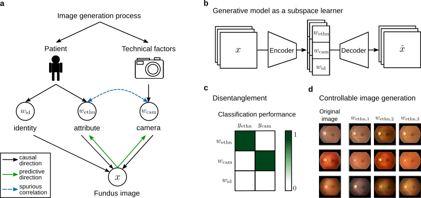

# Disentangling representations of retinal images with generative models
This repository contains the code to reproduce the results from the paper
[Disentangling representations of retinal images with generative models](https://arxiv.org/abs/2402.19186).

We present a novel population model for retinal fundus images that effectively
disentangles patient attributes from camera effects with a a disentanglement loss based
on distance correlation. The resulting models enable controllable and highly realistic
fundus image generation.



# Installation

Set up a python environment with a python version `3.9`. Then, download the repository,
activate the environment and install all other dependencies with
```
cd disentangling-retinal-images
pip install --editable . 
```

This installs the code in `src` as an editable package and all the dependencies in
[requirements.txt](requirements.txt).

# Organization of the repo
* [configs](./configs/): Configuration files for all experiments.
* [scripts](./scripts/): Bash scripts for model training, testing and evaluation.
* [src](./src/): Main source code to run the experiments.
    * [dataset](./src/dataset/): Pytorch EyePACS dataset.
    * [generative_model](./src/generative_model/): Pytorch lightning stylegan module.
    * [evaluation](./src/eval/): Model evaluation with kNN classifiers, image quality
    metrics (fid-score), and swapped subspace classification.
* [train.py](./src/train.py): Model training script. 
* [test.py](./src/test.py): Model testing script.
* [predict.py](./src/predict.py): Image embedding prediction script (model inference).


# EyePACS dataset
The EyePACS dataset can be accessed upon request: https://www.eyepacs.com/. Our dataset parser can be checked out in [dataset/eyepacs_parsing](./src/dataset/eyepacs_parsing/eyepacs.py). 

For our EyePACS pytorch dataset you will need a factorized metadata (with a categorical columns mapping) and a diretory to your dataset splits. Therefore, we also share our scripts to [factorize](./src/dataset/eyepacs_parsing/factorize_meta.py) and to [split](./src/dataset/eyepacs_parsing/split_data.py) the dataset. In [dataset/eyepacs_parsing](./src/dataset/eyepacs_parsing) we share our categorical columns mapping as a reference.

Moreover, before factorizing and splitting the dataset, we pre-processed the retinal fundus images with: https://github.com/berenslab/fundus_circle_cropping.

# Usage

## Model training
For model training, run the following command
```
python src/train.py -c ./configs/configs_train/test.yaml
```
Here we run the model with a test training configuration file. All model configuration
files for reproducing the models of the paper can be found [here](./configs/configs_train).

## Model evaluation
To test the model run the script
```python
python src/test.py -d path/to/experiment/folder -c ./configs/configs_test/file.yaml
```

To predict the learned image embeddings for all data set splits (train, val, test),
execute the bash script
```bash
sh scripts/predict_embeddings.sh path/to/experiment/folder configs/configs_predict/default.yaml
```
with the arguments `$1: path to model experiment folder`,
`$2: configuration file for predict.py`. Hint: you need to adjust `PROJECT_DIR` and
`python_path`.

### kNN classifier performance
Evaluate the kNN classifier performance with the predicted embeddings for EyePACS:
```bash
sh scripts/knn_eval_embeddings.sh path/to/experiment/folder 4 12 16
```
with the arguments `$1: path to model experiment folder`,`$2-$end: subspace dimensions`.
Here, we chose the subspace dimensions of `[age, camera, identity] = [4, 12, 16]`.
Hint: you need to adjust `PROJECT_DIR` and `python_path`.

### Image quality
Compute image quality metrics (fid, kid):
```python
python src/evaluation/eval_image_quality.py -d path/to/experiment/folder -c ./configs/configs_image_quality/default.yaml
```

### Swapped subspaces
Train subspace classifiers on age subspaces:
```python
python src/evaluation/swapped_subspaces/train_age_classification.py -d path/to/experiment/folder -c configs/configs_swapped_subspaces/train_age_classification.yaml
```
Test trained classification model on swapped age subspaces:
```python
python src/evaluation/swapped_subspaces/test_age_classification.py -d path/to/classification/model -c configs/configs_swapped_subspaces/test_age_classification.yaml
```

## Tips to train with a custom dataset
The [stylegan model](src/generative_model/stylegan.py) interface is dataset-agnostic.
Therefore, if you want to train our model on a different dataset, start replacing our
[EyePACS dataset](src/dataset/eyepacs.py) with your dataset and return an identically
structured dictionary in the `__getitem__` function.

# Model weights
The model weight of our trained generative models from the paper can be found on [zenodo](https://zenodo.org/records/13789223).


# Credits
We used a stylegan2-ada pytorch lightning implementation as a starting point for our
experiments: https://github.com/nihalsid/stylegan2-ada-lightning. From this repository
we extended the gan architecture with gan inversion and independent subspace learning
(subspace classifiers and distance correlation loss).


# Cite
If you find our code or paper useful, please consider citing this work.
```bibtex
@misc{mueller2024disentangling,
    title = {Disentangling representations of retinal images with generative models},
    author = {M\"uller, Sarah and Koch, Lisa M. and Lensch, Hendrik, P. A. and Berens, Philipp},
    year = {2024},
    eprint = {2402.19186},
    archivePrefix = {arXiv},
}
``` 